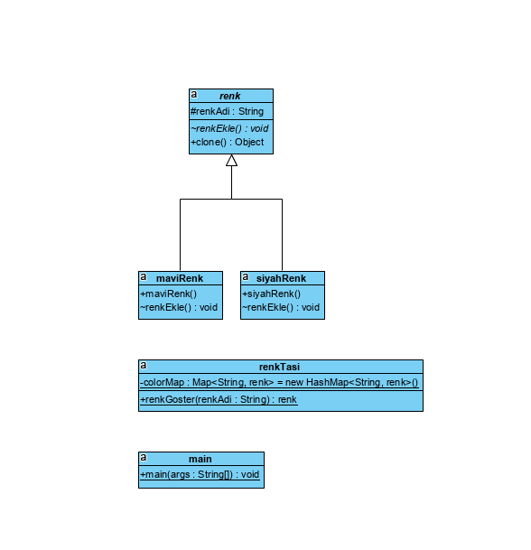

# Prototype

Prototype (prototip) tasarım deseni creational grubununa ait, var olan nesnelerin kopyasının üretiminden sorumlu tasarım desenidir. dofactory.com a göre kullanım sıklığı 60% lardadır. creational grubuna ait tasarım desenlerini bu tasarım deseni ile tamamlayıp, behavioral grubundaki tasarım desenlerini inceliyor olacağız.
Bazı nesnelerin üretilme maliyeti oldukça yüksek olabilir. Veya aynı değerlerde nesne üretilmesi gereken durumlar olabilir. Böyle nesnelerin üretim maliyetini azaltmak için var olan nesnenin kopyasının üretilmesi yoluna gidilebilinir. Prototype tasarım deseni böyle durumdaki nesnelerin yönetilmesini sağlar. Buradaki kopyalama işlemi “Deep Copy – Derin Kopyalama” şeklindedir, yani nesne bire bir kopyalanarak yeni referans değerlere atanır.  Prototype tasarım deseni uygulanması oldukça basittir. İlk olarak içinde kendi türünde değer döndüren bir metot tanımlanmış olan interface veya abstract sınıf tanımlıyoruz. Çalışma zamanında kopyası alınabilecek nesnelerde bu interface veya abstract sınıfı uyguluyoruz. Concrete yani gerçek nesnelerde overwrite ettiğimiz bu metotlarda deep copy işlemini object sınıfında protected olarak tanımlanmış olan MemberwiseClone metodu ile gerçekleştirebiliriz. Concrete prototype sınıflarının farklı property veya metotları da olabilir.

Prototype tasarım deseninde 3 nesne yapısı vardır.
Prototype: Klonlama yapılacak sınıfların uygulaması gereken interface veya abstract sınıf.
Concrete Prototype: Klonlama özelliği olacak gerçek sınıflar.
Client: Klonlanmış nesneyi elde edecek nesne.

Tasarımda ne yaptım?

Klonlanabilir Renk Class'ından türettiğim Siyah ve Mavi Renk Sınıflarını, Renk Taşı sınıfında klonladım. Böylece tek bir Renk Taşı nesnesi ile üretim maliyetinden kar sağlamış oldum.

Tasarım Desenine Ait Class Diagramı

[Tasarım Modeli Açıklama Kaynağı](http://harunozer.com/makale/prototype_tasarim_deseni__prototype_design_pattern.htm)
